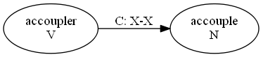
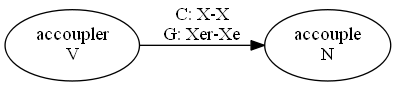

# File name meaning
- `D_*`: Démonette without additional information from Glawinette.

- `DG_*`: Démonette with additional information from Glawinette.

# IPYNB content
- `D_1.ipynb` and `DG_1.ipynb`: Detection of families and creation of graph visualization.
- `D_2.ipynb` and `DG_2.ipynb`: Calculation of AOC-poset, calculation of subposet (parents and children) for each concept.
- `D_3.ipynb`: Detection of missing and false derivations by comparing every pair of neighboring concepts. Results are saved into XLSX files.
- `D_4.ipynb`: Creation of graphs in PNG for web validation. Red and green edges for false and missing derivations, respectively.
- `DG_3.ipynb`: Detection of missing derivations by Glawinette patterns + lexeme frequency + cosine similarity. Results are saved into TXT files.

# File requirements
- Raw csv files, available in [MyCore](https://mycore.core-cloud.net/index.php/s/tFSrR5f7ZkVFwj7/authenticate), folder `Résultats/MigrationRessources/VersionReformateePlateforme_SansSemantique`. Put all csv in `raw_csv_files` folder.
- AOCPosetBuilder.jar [download page](https://www.lirmm.fr/~gutierre/gsh), a Java file for building AOC poset.
- frequencies-frcowvec.csv, words from COW and their frequency (see email from Olivier on 15/10/2021 for the download link).
- glawinette-series.csv (see email from Nabil on 12/09/2021 for the download link).
- lexemes.csv, table of lexemes from Démonette.
- lemma-A-pos-bow.txt [download page](https://zenodo.org/record/5975226), distribution vector of words, for calculating cosine similarity.

# Software requirements
- [NetworkX](https://networkx.org/), Python package for graph manipulation.
- [Graphviz](https://graphviz.org/), for visualizing a graph in a DOT files.